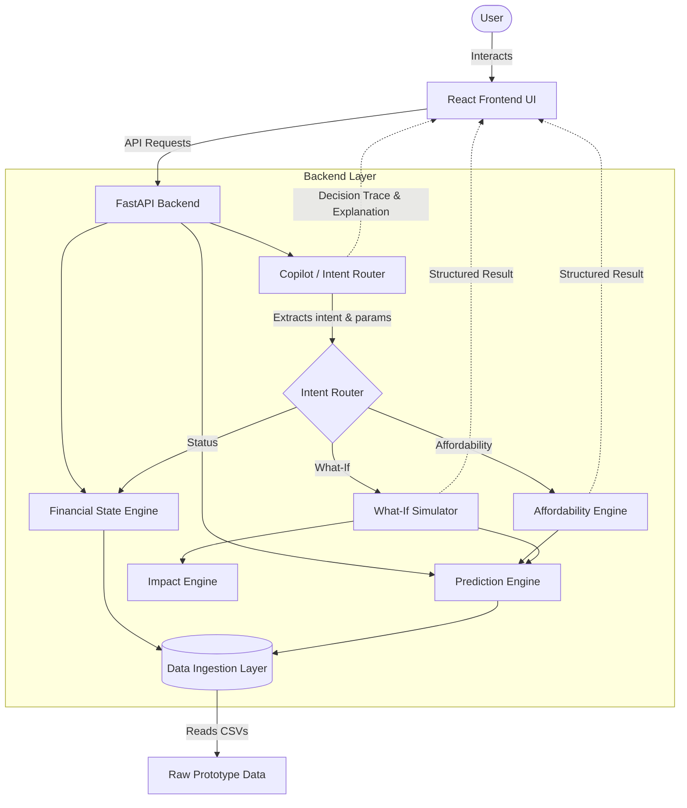

# System Architecture
**FIN4YOU — Financial Health Copilot**

## 1. Architecture Overview
FIN4YOU utilizes a modern, decoupled architecture splitting presentation logic (React/TypeScript) from deterministic financial modeling and intelligence (FastAPI/Python). The system operates strictly on real ingested financial data to ensure outputs are statistically grounded.

## 2. High-Level Architecture Diagram

## 3. Component Architecture

### 3.1 Frontend Architecture (React)
- **Role:** Presentation and user interaction.
- **Key Constraints:** Purely consumes API endpoints. Does not perform local financial modeling.
- **State Management:** Utilizes a global Context (`GlobalStateContext.tsx`) to broadcast financial updates (like a modified profile buffer) globally, ensuring the Dashboard, Forecast, and Copilot pages remain perfectly synchronized.
- **Technology:** React, Vite, Tailwind CSS.

### 3.2 Backend Architecture (FastAPI/Python)
- **Role:** Centralized source of truth for all mathematical models, intent routing, and data aggregation.
- **Technology:** Python 3, FastAPI, Pydantic (strict typing and validation).

#### 3.2.1 Data Ingestion Layer
Loads `.csv` prototype data containing historical transactions and user profiles into memory. Validates raw input against Pydantic models.

#### 3.2.2 Financial Intelligence Layer
- **Financial State Engine:** Aggregates and categorizes historical transactions into clear metrics (income, variable expenses, obligations).
- **Prediction Engine:** Forecasts upcoming cash flow using historical rolling averages and deterministic rule-based analysis.

#### 3.2.3 Decision Engine Layer
- **Affordability Engine:** Given a predicted cash flow and minimum safety buffer, returns a boolean approval matrix for outright purchases or structured installment plans.
- **What-If Simulator & Impact Engine:** Models perturbations to the baseline cash flow (e.g. reducing spending by 10%) and quantifies the exact financial impact (e.g., +₹2,000 to projected savings).

#### 3.2.4 Copilot & LLM Layer (Artha AI)
- **Intent Parser:** Understands conversational prompts (e.g., "Can I buy a laptop for ₹50,000?") and maps them to a recognized `IntentType`.
- **Orchestrator:** Routes the intent to the correct underlying deterministic engine (e.g., `AffordabilityEngine`).
- **Response Generator:** Takes the structured mathematical output from the engines and generates a clear, conversational explanation, complete with a **Decision Trace** detailing *how* the system arrived at the result.

## 4. Request Lifecycle (Example: Affordability Check)
1. **User** types: "Can I afford a new TV for ₹50,000?"
2. **React Frontend** sends a POST request to `/api/copilot/query`.
3. **FastAPI** routes request to `CopilotOrchestrator`.
4. **Intent Parser** identifies `AFFORDABILITY_CHECK` and extracts `amount = 50000`.
5. **Orchestrator** calls `AffordabilityEngine`.
6. **AffordabilityEngine** queries `PredictionEngine` for next month's cash flow.
7. **AffordabilityEngine** calculates options and returns a structured matrix.
8. **Orchestrator** calls `ResponseGenerator` to wrap the matrix in an explanation.
9. **React Frontend** receives the structured JSON and renders the explanation, tables, and Decision Trace.

## 5. Current Prototype Limitations
- **Data Persistence:** Currently relies on read-only CSV datasets and in-memory updates. Edits do not persist across hard server restarts.
- **Authentication:** Runs in a single-user prototype context without JWT or OAuth barriers.

## 6. Future Production Architecture (FUTURE SCALE)
For a production deployment, the architecture would evolve to include:
- **Database:** PostgreSQL for persistent transaction and profile storage.
- **Auth:** OAuth2 / OpenID Connect for secure user sessions.
- **Cloud Infrastructure:** Kubernetes deployments on AWS/GCP with dedicated microservices for the Intent Router and Financial Engines.
- **Live Integrations:** Plaid or Yodlee integrations for real-time bank transaction ingestion.
